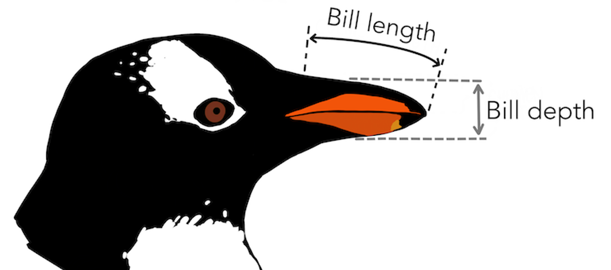

```{r setup, include=FALSE} 
library(knitr)
knitr::opts_chunk$set(warning = FALSE, message = FALSE, echo=FALSE) 
knitr::opts_chunk$set(cache.extra = rand_seed)
set.seed(105134)
```

```{r, echo=FALSE}
library(palmerpenguins)
library(leaps)
library(purrr)
library(dplyr)
library(tidyverse)
library(ggplot2)
library(readr)
library(rsample)
data(penguins)
penguins <- penguins[complete.cases(penguins),]
```

## How do penguin characteristics affect its body mass? 
<div class="columns-2">
{width=100%}
{width=100%}

- Data has 333 rows

- Collected over 2007-2009 in Antarctica

- Categorical Features:

     <b>Sex, Species, Island</b>

- Continuous Features:
     
     <b>Bill Length, Bill Depth, Flipper Length, Body Mass</b>

</div>

## Plot Analysis
```{r, out.width="100%"}
penguins%>%
  mutate(index = seq(1,length(penguins$sex)))%>%
  select(-c(year,island))%>%
  filter(complete.cases(.))%>%
  gather(key='Predictor',value = 'Predictor Value',-c(index,species,body_mass_g,sex))%>%
  ggplot(mapping = aes(x=`Predictor Value`,y=body_mass_g,group=species,color=species))+
  geom_point()+
  geom_smooth(method = lm)+
  facet_grid(vars(sex),vars(Predictor),scales="free")+
  theme_bw()
```

## Best Subsets Regression Result

Simple (Model A)

\[\scriptstyle \text{BodyMass } = \text{ Male } + \text{ Gentoo } + \text{ Bill Depth } + \text{ Flipper Length}\]


Complex without Interactions (Model B)
\[\scriptstyle
\begin{aligned}
\text{BodyMass } = \text{ Male } &+ \text{ Gentoo }+\text{ Chinstrap }\\
&+\text{ Bill Length } +\text{ Bill Depth } + \text{ Flipper Length}
\end{aligned}\]

Complex with Interactions (Model C)
\[\scriptstyle\begin{aligned}\text{BodyMass } = \text{ Male } &+ \text{ Gentoo }+\text{ Chinstrap }\\
&+\text{ Bill Length } *\text{ Bill Depth }+\text{ Bill Length }*\text{ Flipper Length }
\end{aligned}\]

## Model Comparison
### Anova $F$-Test $p$-values
```{r}
formulaA <- body_mass_g~male+gentoo+bill_depth_mm+flipper_length_mm

dfA <- mutate(penguins,male = as.factor(penguins$sex == "male"),
                             gentoo = as.factor(penguins$species == "Gentoo"))

formulaB <- body_mass_g~sex+species+bill_length_mm+bill_depth_mm+flipper_length_mm
  
formulaC <- body_mass_g~sex+species+bill_length_mm*bill_depth_mm+flipper_length_mm*bill_length_mm

modelA <- lm(formulaA, dfA)
modelB <- lm(formulaB, data=penguins)
modelC <- lm(formulaC, data=penguins)
anovaAB <- anova(modelA, modelB)
anovaBC <- anova(modelB,modelC)
```

- $A$ to $B$: `r anovaAB$'Pr(>F)'[[2]]`

- $B$ to $C$: `r anovaBC$'Pr(>F)'[[2]]`

### $15$-fold Cross-Validation
```{r}
CV_outA <- vfold_cv(dfA, v=15) %>% 
  rowwise() %>% 
  mutate(fit=list(lm(formulaA, data=splits)), predictions = list(predict(fit,assessment(splits))), mse = mean((assessment(splits)$body_mass_g-predictions)^2, na.rm=T))
CVA<- CV_outA %>% 
ungroup() %>% 
  summarize(se=sd(mse/sqrt(n())),mse=mean(mse))
  

CV_outB <- vfold_cv(penguins, v=15) %>% 
  rowwise() %>% 
  mutate(fit=list(lm(formulaB, data=splits)), predictions = list(predict(fit,assessment(splits))), mse = mean((assessment(splits)$body_mass_g-predictions)^2, na.rm=T)) 
CVB<- CV_outB%>% 
  ungroup() %>% 
  summarize(se=sd(mse/sqrt(n())),mse=mean(mse))

CV_outC <- vfold_cv(penguins, v=15) %>% 
  rowwise() %>% 
  mutate(fit=list(lm(formulaC, data=splits)), predictions = list(predict(fit,assessment(splits))), mse = mean((assessment(splits)$body_mass_g-predictions)^2, na.rm=T)) 
CVC <- CV_outC %>% 
  ungroup() %>% 
  summarize(se=sd(mse/sqrt(n())),mse=mean(mse))
```

```{r}
table <- data.frame(rbind(CVA,CVB,CVC)) 
table$Model <- c("A","B","C")
table <- table[, c("Model", "mse", "se")]
  names(table) <- c("Model","Mean Squared Error","Standard Error") 
  knitr::kable(table)
```

## Bootstrap Confidence Intervals

```{r}
coeff_hat <- function(df, formula) {
  df <- as.data.frame(df)
  bhh_lm <- lm(formula,
               data = df)
  coe <- coef(bhh_lm)
  estimates <- coe
  return(estimates)
}

bootConfidence <- function(df, formula, bootTimes = 200)
{
  coeff_hat_res <- coeff_hat(df,formula)
  coeff_hat_penguins <- as.numeric(coeff_hat_res)
  coeff_hat_names <- names(coeff_hat_res)

  differences <- df %>%
    bootstraps(times = bootTimes) %>%
    rowwise() %>%
    mutate(diff = list(coeff_hat(splits, formula) - coeff_hat_penguins)) %>%
    select("diff") %>%
    unnest() %>%
    deframe() %>%
    matrix(nrow = bootTimes, byrow = TRUE)
  
  upper <- coeff_hat_penguins - apply(differences, 2, quantile, probs=0.05/2)
  lower <- coeff_hat_penguins - apply(differences, 2, quantile, probs=1-0.05/2)
  confidence <- data.frame('Estimated Coefficients' = coeff_hat_penguins, 'Lower Bound' = lower,'Upper Bound' = upper)
  rownames(confidence) <- coeff_hat_names
  return(confidence)
   
}

```

```{r}
bootConfA <- bootConfidence(dfA, formulaA)
bootConfB <- bootConfidence(penguins, formulaB)
bootConfC <- bootConfidence(penguins, formulaC)
```

Model A
```{r}
bootConfA[-1,]
```
Model B
```{r}
bootConfB[-1,]
```

## Conclusions

-   Overall, the *penguins* data-set is an excellent practice for newcomers into data analysis.

-   The models and plots show clear species differences and the remarkable dependence of mass on bill and flipper characteristics.

-   Model C highlighted the importance of interaction terms in explaining variance, but also gives a warning about the challenges of interpretation.

-   All models considered have similar predictive power.

## Thank you!

### And now, a bad joke:

#### Why did the R programmer always use a `for` loop?

#### Because they don't know how to use a `map()`!

